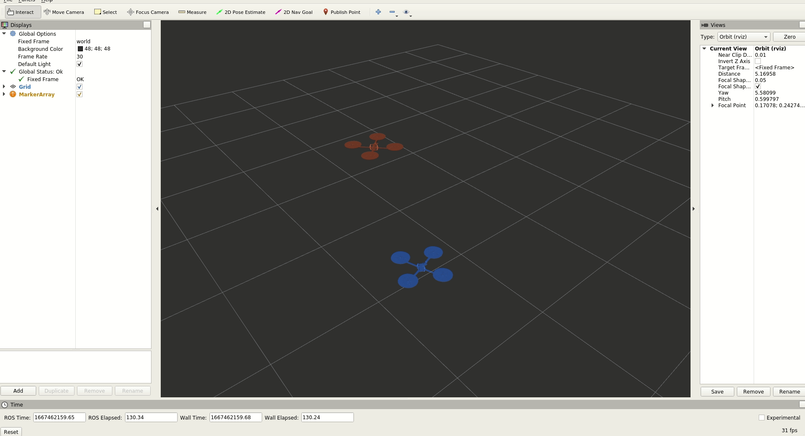
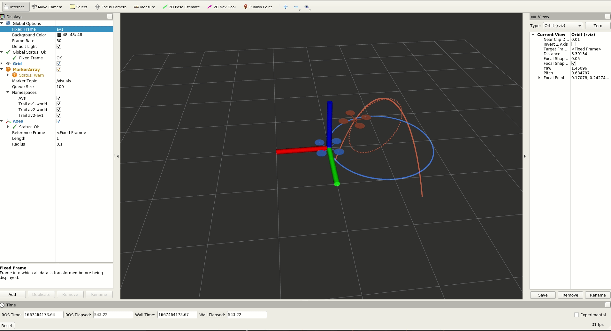

# MIT_VNAV_LAB

Code for MIT16.485 - Visual Navigation for Autonomous Vehicles
https://vnav.mit.edu/

## Lab1 Shell basics, Git , C++
To compile code:
```bash
cd lab1 
g++ -std=c++11 -Wall -pedantic -o random_vector main.cpp random_vector.cpp
./random_vector
```

## Lab2 ROS Exercises
Run the following command in terminal to see the visualization results.
```bash
cd lab2
catkin_make
source devel/setup.bash
roslaunch two_drones_pkg two_drones.launch
```

Publishing the transforms of drones


Visualizing the trajectories and relative trajectory of drones

Trajectories in the world frame, blue for drone1, orange for drone2, dashed orange for drone2 refered to drone1


Trajectories in drone1's frame, the drone1(blue drone) is static while drone2(orange drone is moving relative to drone1's frame)
